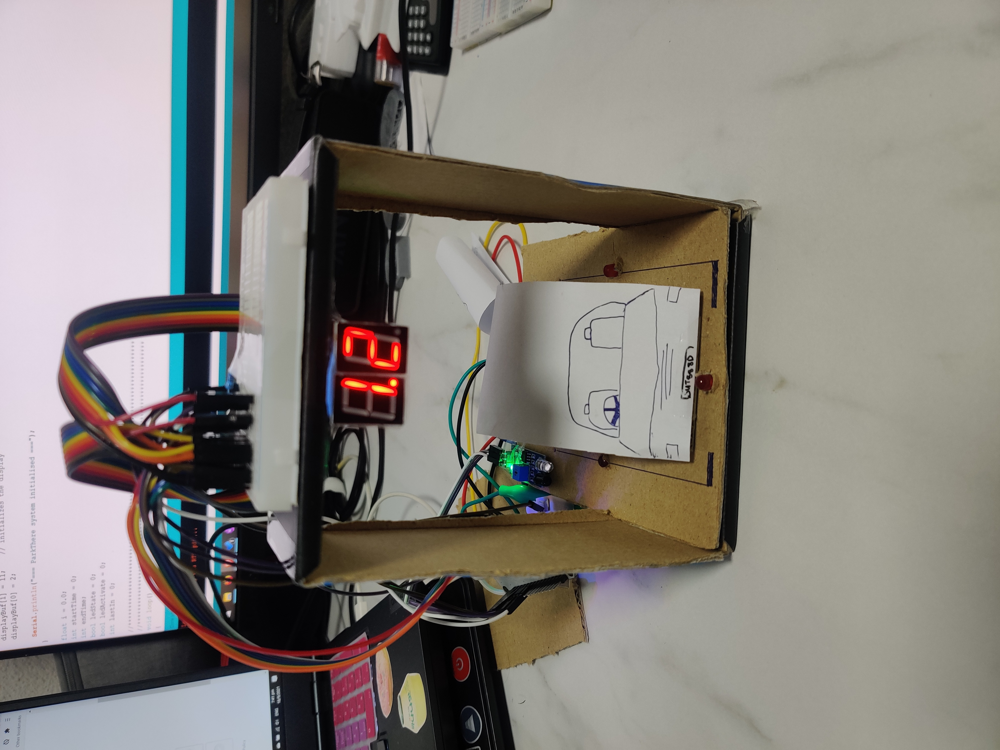
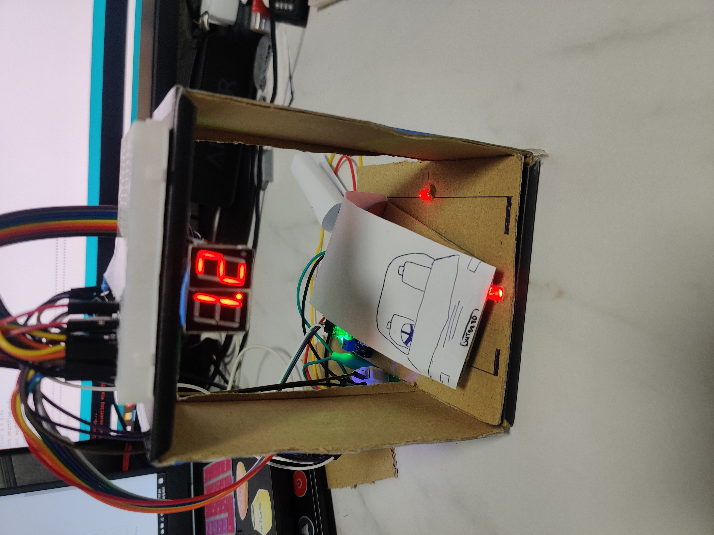

# ParkThere

🌟 **Awarded Best Transportation Hack - SUTD What the Hack 2021.**

ParkThere is Team HZAUP's submission for SUTD What the Hack 2021. 

Project Introduction: https://youtu.be/qT7kYox3YoQ

## Primary Feature

In most car-parks, lots located further from the entrance are often severely under-utilised. Our solution, **ParkThere**, tackles this issue. The primary feature of this Smart Car-park, is a system designed to allocate **different pricing per hour of parking** for each section of the car-park, assigning lower prices for lots further away from the entrance. The prices of lots within each section are assigned automatically by the specific price algorithm that the management of the buildings choose. The different prices of parking are displayed on a monitor placed above the lots, giving drivers more incentive to park in lots further away from the entrance, making better use of all the lots, and reducing vehicle congestion nearer the entrance. 

## Secondary Features
ParkThere has secondary features that include a central parking guide that uses sensors and mini-speakers to **ensure drivers park their car fully within the lot**, and not exceed the allocated space. This ensures that all lots are usable, and prevents decentralised parked cars from occupying more than one lot. 

Finally, the same cameras that provide information on the vacancy of each lot, records down the vehicle number, helping users who are leaving easily find their vehicles through a touchscreen system.

## Prototype

Prototype of how a ParkThere parking lot will look like. Display mounted to the ceiling will indicate the current price per hour of the parking lot. Encouraging drivers to park further away from high traffic areas. Price of the display can be easily changed by the building management dynamically, depending on the current situation in the carpark. The lower priced parking lots can be adjusted to encourage drivers to park at available locations rather than the most convenient ones.

The prototype runs on an ESP32, which will enable ParkThere to be controlled over-the-air via the internet in future improvements.

A warning system will be activated when our sensors detect that a car is not parked fully within the lot and the driver has alighted the vehicle. In our prototype, we make use of an IR sensor as a proof of concept to detect the vehicle misalignment to the lot. The warning light will trigger when the misalignment is detected for 3 seconds.

### Members
Ian Goh

Janani Sureshkumar

Joyce Lim

Shaun Neo